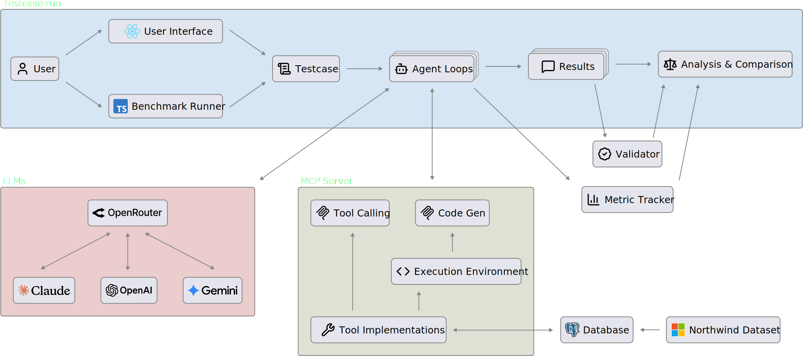
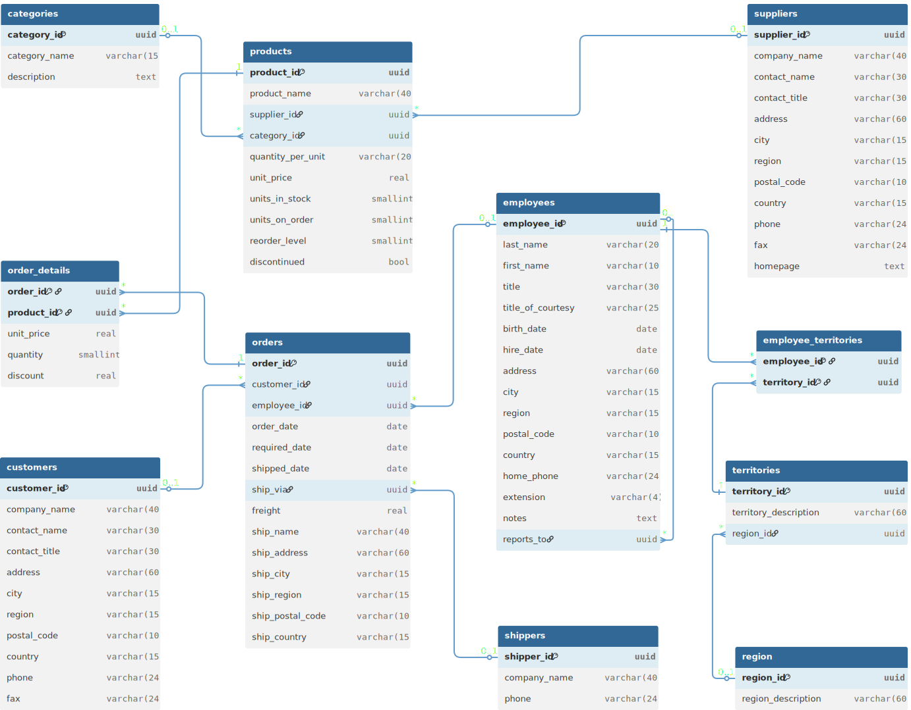

# MCP Benchmark: Tool-Calling vs. Code-Generation in LLM-Based Agents

A benchmark system to systematically compare both tool interaction approaches in LLM-based agents using the [Model Context Protocol (MCP)](https://modelcontextprotocol.io). This project was developed as part of a bachelor's thesis.

## What is this about?

LLM-based agents rely on tools to go beyond pure text generation. The Model Context Protocol, introduced by Anthropic in November 2024, has emerged as the de-facto standard for connecting LLMs to external systems.

### The Problem with Traditional Tool-Calling

The established approach for tool integration is **direct Tool-Calling**: the LLM selects a tool, calls it, receives the result back into its context, and decides on the next step. While straightforward, this approach has significant drawbacks rooted in the stateless nature of LLMs: Every tool result must be fed back into the context. For multi-step tasks, token usage compounds rapidly since the entire conversation history — including all previous tool results — must be re-sent with each subsequent LLM call.

Furthermore, all logic such as filtering, aggregation, and data transformation is performed implicitly by the LLM through probabilistic next-token prediction instead of deterministic computation. Results can be unreliable — especially with large or complex data.

### Code-Generation as an Alternative

In late 2025, [Anthropic](https://www.anthropic.com/engineering/code-execution-with-mcp) and [Cloudflare](https://blog.cloudflare.com/code-mode/) proposed an alternative approach: **Code-Generation** (also referred to as _Code Execution_, _Code Mode_ or _Programmatic Tool Calling_). Instead of presenting tools as directly callable tools, they are described to the LLM as TypeScript function signatures. The LLM then generates code that orchestrates these functions — with loops, conditionals, and data transformations expressed explicitly in code. This code is executed in an isolated sandbox environment, and only the final result is returned to the LLM's context.

This approach promises reduced token consumption and lower latency, since intermediate results never enter the LLM's context and multiple tool calls can be batched into a single code execution step. However, existing evaluations of both approaches have been based primarily on anecdotal evidence and selective examples — not on systematic empirical evaluation.

### This Benchmark

This project provides a controlled experimental setup. It compares both approaches across:

- **6 LLMs** from 3 providers (OpenAI, Anthropic, Google) in two capability tiers (large and lightweight)
- **12 test cases** mapped to a two-dimensional complexity taxonomy combining dependency structure (independent, sequential, iterative) and data complexity (simple, complex)

## Architecture



The system is built as a **Next.js** full-stack application with the following key components:

- **Benchmark Runner (CLI)** — Automated execution of test cases with configurable models, approaches, and iteration counts.
- **Web UI** — Interactive interface for running individual test cases and visualizing results.
- **Agent Loop** — The core orchestration loop shared by both runner and UI via dependency injection. It manages the iterative cycle of LLM calls and tool execution.
- **MCP Server** — Exposes 18 database tools (read-only) via the MCP TypeScript SDK.
- **Metric Tracker** — Records token usage, LLM call count, and execution time per run.
- **Validator** — Automatically checks final answers against predefined regex patterns.

## Database & Tools



The Northwind database models a fictional e-commerce company with 10 entities. Agents interact with it through **18 read-only tools** in three categories:

| Category            | Tools                                                       | Description                                                    |
| ------------------- | ----------------------------------------------------------- | -------------------------------------------------------------- |
| **Core**            | `getCustomerById`, `getProductById`, `getOrderById`, ...    | Retrieve single records by UUID                                |
| **Search & Filter** | `getManyCustomers`, `getManyOrders`, `getManyProducts`, ... | Filter, sort, and paginate across tables                       |
| **Aggregation**     | `getOrderTotal`, `getProductSales`                          | Compute cross-table aggregations (order totals, product sales) |

## Test Cases

12 test cases cover a **2×3 complexity matrix**:

- **Tool dependency**: Independent, Sequential, Iterative
- **Data complexity**: Simple, Complex

| #   | Dependency  | Data    | Task                                                                            |
| --- | ----------- | ------- | ------------------------------------------------------------------------------- |
| 1   | Independent | Simple  | Look up customer contact details by company name                                |
| 2   | Independent | Simple  | Retrieve names and phone numbers of 3 shippers by ID                            |
| 3   | Independent | Complex | Find all products with stock below reorder level                                |
| 4   | Independent | Complex | Count customers per country                                                     |
| 5   | Sequential  | Simple  | Find the shipper of a customer's last order                                     |
| 6   | Sequential  | Simple  | Find the supervisor of the employee who handled a customer's last order         |
| 7   | Sequential  | Complex | Calculate total inventory value for a supplier's active products                |
| 8   | Sequential  | Complex | Find the most expensive line item (after discount) from a customer's last order |
| 9   | Iterative   | Simple  | List suppliers for each product in a category                                   |
| 10  | Iterative   | Simple  | List all product names from the last order shipped to a specific country        |
| 11  | Iterative   | Complex | Calculate total revenue for a customer                                          |
| 12  | Iterative   | Complex | Find the best-selling product in a category and list its customers              |

## Getting Started

### Prerequisites

- Node.js ≥ 18
- A PostgreSQL database (e.g. [Neon](https://neon.tech))
- API keys for OpenAI and [OpenRouter](https://openrouter.ai)

### Setup

```bash
# Clone the repository
git clone https://github.com/MathisChalland/mcp-benchmark.git
cd mcp-benchmark

# Install dependencies
npm install

# Configure environment variables
cp .env.example .env
# Fill in your database URL and API keys in .env

# Set up the database
npx prisma migrate deploy
npm run db:seed

# Start the development server (Web UI)
npm run dev
```

### Running the Benchmark (CLI)

```bash
npm run benchmark
```

The interactive CLI will prompt you to select:

1. **Test case** — which of the 12 test cases to run
2. **Approach** — tool-calling, code-generation, or both
3. **Models** — which LLMs to test
4. **Iterations** — number of runs per configuration

Results are stored in a JSON file.

### Using the Web UI

Open `http://localhost:3000` to:

- Run individual test cases interactively
- Inspect agent message traces and tool calls step by step
- Enter custom prompts (without automated validation)

## Extending the Benchmark

The benchmark is designed for easy extensibility. All core logic lives in `src/benchmark/`, and is consumed by the CLI runner and the Web UI.

### Adding a Test Case

Define a new entry in `src/benchmark/test-cases.ts` using the `TestCase` interface:

```typescript
export interface TestCase {
  id: string;
  instruction: string;
  toolDependency: "independent" | "sequential" | "iterative";
  dataComplexity: "simple" | "complex";
  validator?: {
    required: RegExp[];
    forbidden?: RegExp[];
  };
}
```

The new test case is immediately available in both the CLI runner and Web UI. The optional `validator` allows automated correctness checking via regex;

### Adding a Tool

1. **Implement the tool** in `src/benchmark/tools/`. Each tool file defines three things: a Zod input schema, a tool definition (title, description, schema), and the database query function:

```typescript
import { z } from "zod";
import { db } from "@/server/db";

// Input schema using Zod
export const getExampleSchema = {
  inputSchema: {
    exampleId: z.string().describe("The ID of the example to retrieve"),
  },
};

// Tool definition (used for MCP registration)
export const getExampleToolDefinition = {
  title: "Get Example",
  description: "Retrieves an example by its ID from the database",
  ...getExampleSchema,
};

// Database query logic
export async function getExampleById({
  exampleId,
}: {
  exampleId: string;
}): Promise<Example> {
  const example = await db.example.findUnique({
    where: { id: exampleId },
  });
  if (!example) {
    throw new Error(`Example with ID ${exampleId} not found`);
  }
  return example;
}
```

2. **Register the tool** on the tool-calling MCP server in `src/benchmark/mcp-server/tool-calling.ts`:

```typescript
server.registerTool("get_example", getExampleToolDefinition, async (props) => {
  const result = await getExampleById(props);
  return {
    content: [{ type: "text", text: JSON.stringify(result) }],
  };
});
```

3. **Generate the code-generation tool definitions:**

```bash
npx tsx src/benchmark/code-approach/generate-tools-api-def.ts
```

This script reads all tools in `src/benchmark/tools/` and generates the TypeScript API definition file that the code-generation approach uses to expose tools as callable functions. This script must always be run when modifying any of the tools.

**Important:** The tool function must have an explicit return type in its signature, since this is the only type information the LLM receives when generating code. The return type can be defined inline or reference interfaces from `src/benchmark/code-approach/types.ts`:

```typescript
export async function getProductSales({
  productId,
  startDate,
  endDate,
}: {
  productId: string;
  startDate?: string;
  endDate?: string;
}): Promise<{
  productId: string;
  productName: string;
  totalQuantity: number;
  revenue: number;
  orderCount: number;
  product?: Product; // from types.ts
}>;
```
